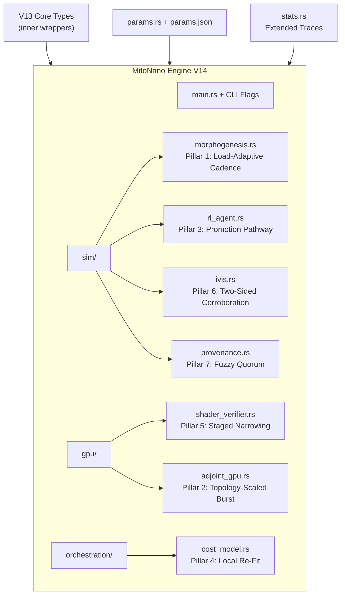
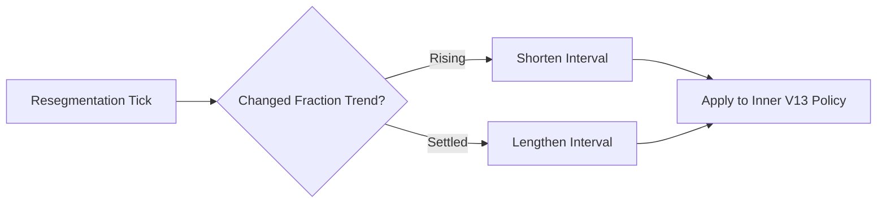

# MitoNano Engine V14

**Advanced Clinical Infrastructure for Boundary-Adaptive, Drift-Detected, Self-Remediating Biomedical Simulation and Orchestration**

[](https://www.rust-lang.org/)
[](https://doc.rust-lang.org/cargo/)
[](LICENSE)

---

## Overview

**MitoNano Engine** is a high-performance, modular Rust framework designed for real-time biomedical simulation, GPU-accelerated modeling, reinforcement-learning-based taxonomy extension, and federated clinical orchestration. It powers adaptive fiber remodeling, adjoint forecasting, track corroboration, provenance tracking, and cost-optimal routing in complex biological and clinical environments.

**V14** represents a major evolutionary step focused on **proportional effort allocation**: the system now scales its computational investment, remediation depth, and promotion decisions in direct proportion to observed drift, risk, and activity levels — closing the gap between detection and effective action.

**Core Theme Evolution**:
- **V13**: "Noticing when 'right now' has quietly become 'six months ago'"
- **V14**: "Spending effort/friction/promotion in proportion to actual drift or risk"

Every V14 improvement is **additive and backward-compatible**. Existing `params.json`, CLI commands, and V13 behavior are preserved exactly when new configuration fields are left at their default (`None`).

### Why Build on Previous Versions?

MitoNano follows a strict **compositional architecture** across versions:
- Each version **wraps** the prior version's core types as an `inner` field.
- New features are gated behind Cargo features and `Option<NewConfig>` fields with `#[serde(default)]`.
- This design guarantees **exact behavioral reproduction** of V13 (and earlier) when V14 extensions are disabled.
- **Why install old versions as bases?**
  - **Incremental verification**: You can test V14 features in isolation against a known-good V13 baseline.
  - **Migration safety**: Production deployments can enable one pillar at a time without risking regression.
  - **Auditability**: Every change is layered; full history remains traceable through composition.
  - **Reproducibility**: Existing datasets, params files, and simulation seeds continue to produce bit-identical results until you explicitly enable new behavior.
  - **Research & Compliance**: Critical in clinical/biomedical contexts where deterministic, auditable evolution is mandatory.

This "onion" architecture allows the project to grow indefinitely without breaking changes.

---

## Installation Prerequisites

### System Requirements
- **Rust**: Stable toolchain (1.75+ recommended). Install via [rustup](https://rustup.rs/).
- **CUDA / GPU Support**: NVIDIA GPU with CUDA 11.8+ for `gpu/` modules (optional but recommended for adjoint and shader components).
- **Operating System**: Linux (primary), macOS, Windows (limited GPU support).
- **Build Dependencies**:
  - `pkg-config`
  - `clang` / `libclang-dev` (for bindgen if shaders evolve)
  - Git LFS (for large test data files, if present)

### Setup Steps

```bash
# 1. Install Rust
curl --proto '=https' --tlsv1.2 -sSf https://sh.rustup.rs | sh

# 2. Clone repository (replace with actual URL)
git clone https://github.com/yourorg/mitobci-engine.git
cd mitobci-engine

# 3. Install prerequisites
sudo apt-get update && sudo apt-get install -y \
    build-essential pkg-config libssl-dev clang

# 4. (Optional) CUDA setup
# Follow NVIDIA CUDA Toolkit installation for your distro

# 5. Build
cargo build --features v14-full
```

**Note**: No new external crates were added in V14 — dependencies remain identical to V13.

---

## Project Architecture Diagram



---

## Key V14 Improvements

| Pillar | Improvement | V13 Baseline | Module | Benefit |
|--------|-------------|--------------|--------|---------|
| **1** | **Load-Adaptive Resegmentation Cadence** | Fixed interval | `sim/morphogenesis.rs` | Saves compute on stable boundaries |
| **2** | **Topology-Scaled Burst Threshold** | Global constant | `gpu/adjoint_gpu.rs` | Scales sensitivity with fleet size |
| **3** | **Provisional-Cluster Promotion** | Propose-only | `sim/rl_agent.rs` | Automates taxonomy growth |
| **4** | **Bounded Local Region Re-Fit** | Flag-only | `orchestration/cost_model.rs` | Automatic correction of drift |
| **5** | **Staged Narrowing** | One-shot | `gpu/shader_verifier.rs` | Safer, auditable remediation |
| **6** | **Two-Sided Anomaly Detection** | High-side only | `sim/ivis.rs` | Catches fragmentation risks |
| **7** | **Fuzzy-Overlap Quorum** | Exact match | `sim/provenance.rs` | Resists quorum manipulation |

---

## Detailed Pillar Documentation

### 1. Load-Adaptive Resegmentation Cadence
Dynamically adjusts resegmentation frequency based on boundary activity trends.

**Key Types**: `LoadAdaptiveResegmentingBoundaryAttenuatedModel`, `ResegmentationCadenceConfig`



### 2–7. (See full V14 spec in `MitoNanoV14.txt` for in-depth code and rationale)

---

## Cargo Features

```toml
[features]
v14-full = ["v13-full", "fem-boundary-remodel-load-adaptive-cadence", ...]

# Enable individually for staged rollout
fem-boundary-remodel-load-adaptive-cadence = ["..."]
```

---

## Usage & Examples

```bash
# Run a specific V14 example
cargo run --example region_drift_bounded_local_refit_single_region --features cost-trajectory-frontier-region-locally-refitting
```

Full examples for each pillar are in `/examples/`.

**Configuration** via `params.json` — all new fields are optional.

---

## Statistics & Observability

V14 adds dedicated traces for every pillar while preserving V13 logs. Perfect for debugging proportional behavior.

---

## Development & Migration

- **Fully backward-compatible** with V13.
- See `MitoNanoV14.txt` §10 for migration table.
- Recommended: Start with Pillars 4 & 6 in non-critical environments.

**Philosophy**: This scaffold demonstrates how the system can evolve safely. Real-world usage should prioritize property-based testing.

---

**For full architecture details, see `MitoNanoV14.txt` in the repository root/attachments.**

Built with rigorous compositional design for long-term clinical reliability.
```

